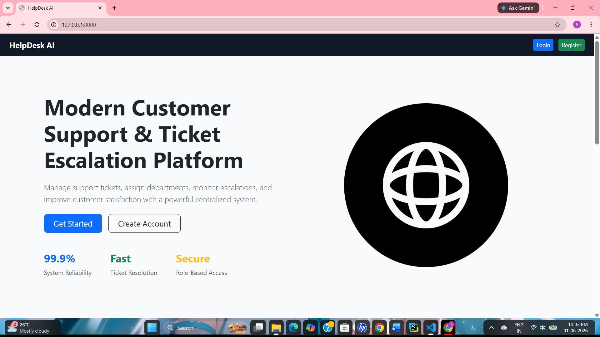
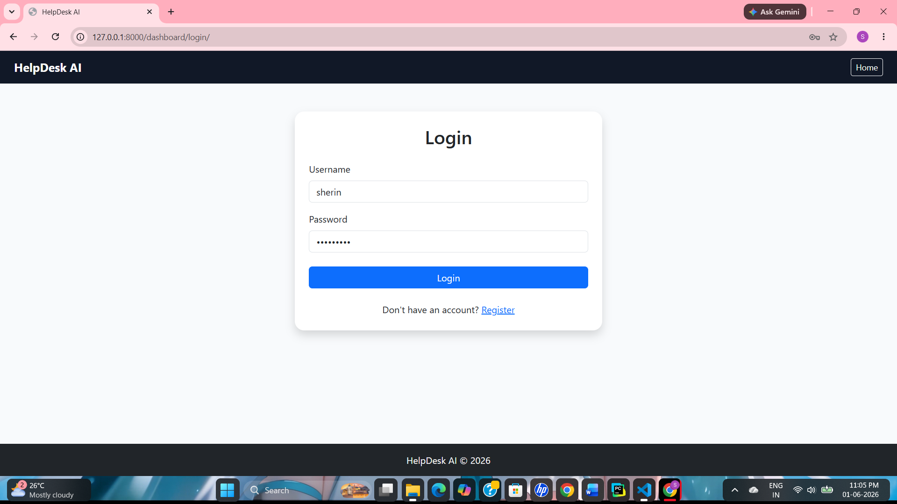
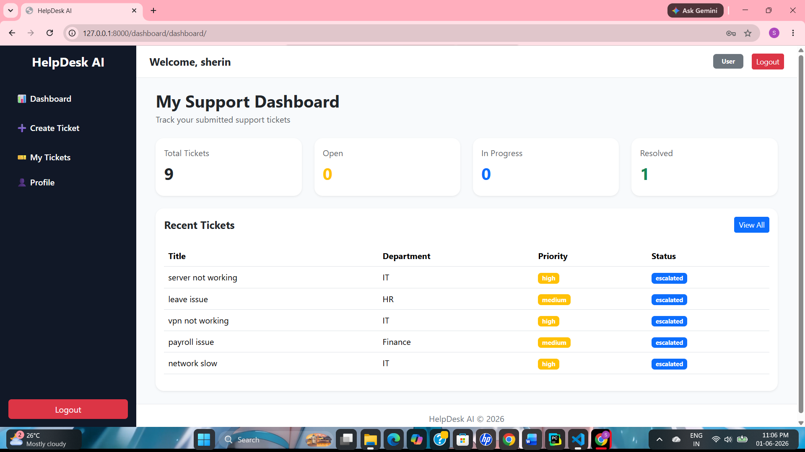
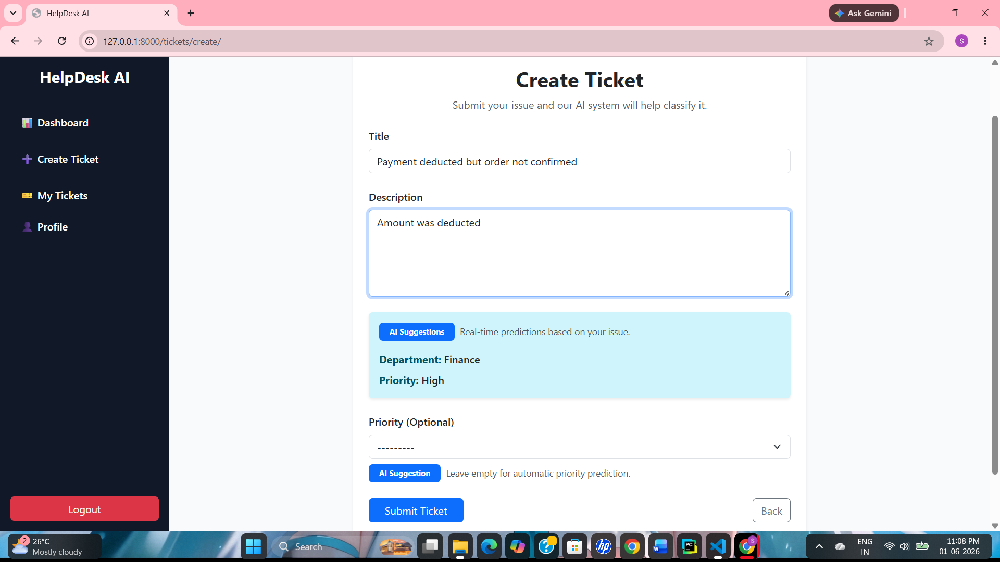
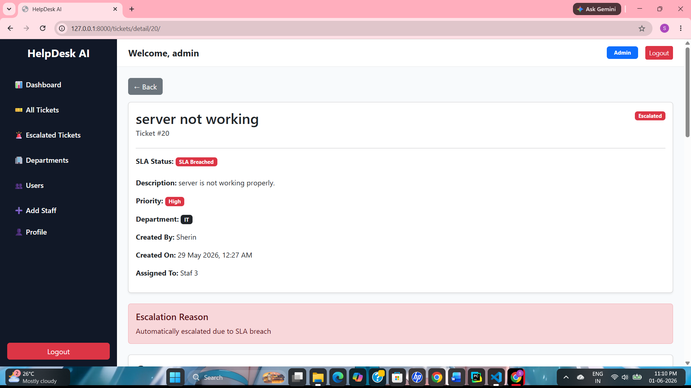
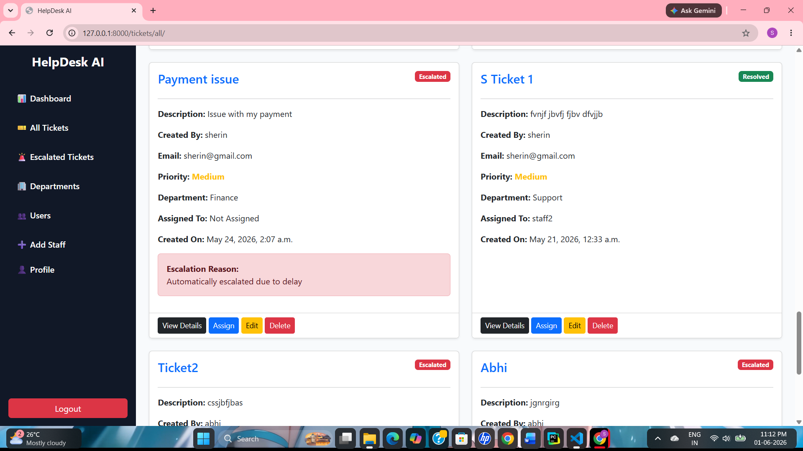
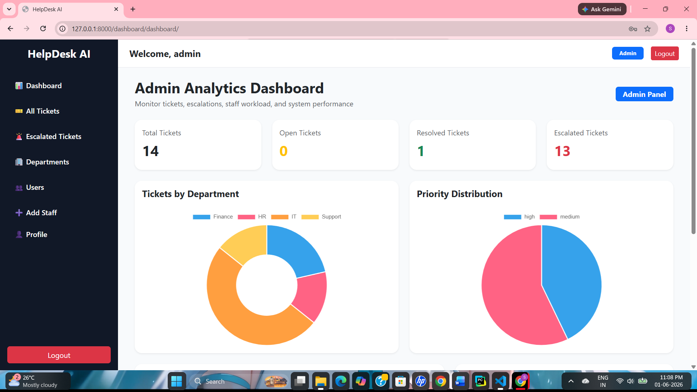
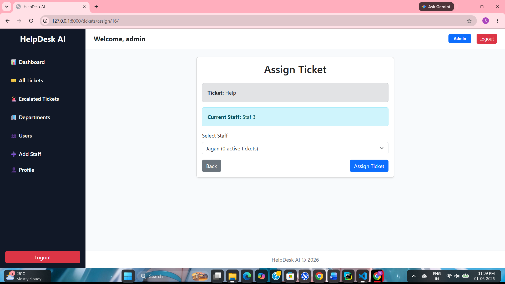
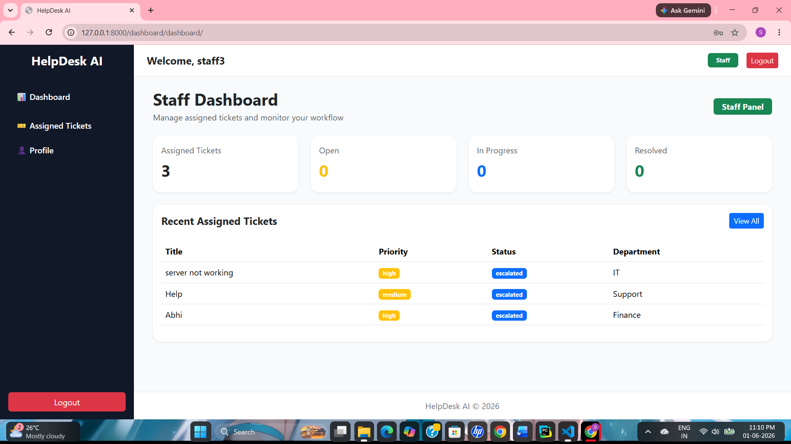
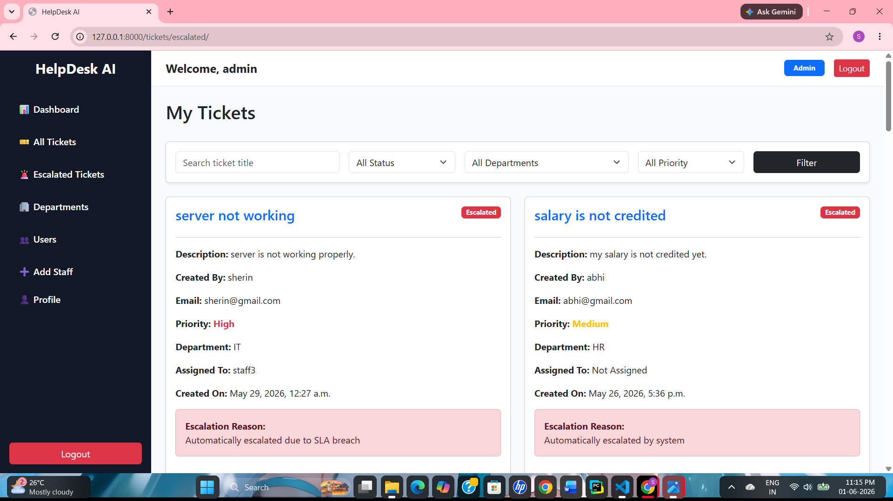

# HelpDesk AI

An AI-powered Help Desk and Ticket Management System built with Django and Machine Learning. The system automates ticket classification, priority prediction, workload-based assignment, SLA monitoring, and ticket escalation to improve customer support operations.

---

## Features

### User Features
- User registration and authentication
- Create and track support tickets
- View ticket details and status updates
- Comment on tickets
- Profile management

### Staff Features
- View assigned tickets
- Update ticket status
- Escalate tickets when required
- View SLA countdown and ticket details
- Profile management

### Admin Features
- Dashboard analytics and ticket statistics
- Manage departments
- Manage users and staff
- View all tickets
- Manual ticket reassignment
- Workload-aware staff assignment suggestions
- Escalated ticket monitoring
- Ticket history tracking

### AI Features
- Department prediction using Machine Learning
- Priority prediction using Machine Learning
- Automatic ticket routing to the appropriate department
- Automatic assignment to the least busy staff member

### SLA & Escalation
- Priority-based SLA monitoring
- Automatic SLA breach detection
- Automatic ticket escalation
- SLA timer reset on reassignment
- Escalation history tracking

---

## Screenshots

### Landing Page


### Login


### User Dashboard


### Create Ticket


### Ticket Details & SLA Monitoring


### My Tickets


### Admin Dashboard


### Ticket Assignment


### Staff Dashboard


### Escalated Tickets


---

## Tech Stack

### Backend
- Python
- Django

### Database
- SQLite

### Frontend
- HTML
- CSS
- Bootstrap 5
- JavaScript

### Machine Learning
- Scikit-learn
- Pandas
- NumPy
- Joblib

### Scheduling
- APScheduler

---

## Project Architecture

```text
User Ticket
      ↓
AI Department Prediction
      ↓
AI Priority Prediction
      ↓
Department Selection
      ↓
Automatic Staff Assignment
      ↓
Ticket Processing
      ↓
SLA Monitoring
      ↓
Auto Escalation (if SLA breached)
```

---

## Installation

### Clone Repository

```bash
git clone https://github.com/sherin42/helpdesk-ai.git
cd helpdesk-ai
```

### Create Virtual Environment

```bash
python -m venv venv
```

### Activate Virtual Environment

Windows:

```bash
venv\Scripts\activate
```

Linux/Mac:

```bash
source venv/bin/activate
```

### Install Dependencies

```bash
pip install -r requirements.txt
```

### Configure Environment Variables

Create a `.env` file:

```env
SECRET_KEY=your_secret_key_here
```

### Apply Migrations

```bash
python manage.py migrate
```

### Create Superuser

```bash
python manage.py createsuperuser
```

### Run Server

```bash
python manage.py runserver
```

Open:

```text
http://127.0.0.1:8000
```

---

## Machine Learning Models

### Department Classification

Predicts the most suitable department:

- Finance
- IT
- HR
- Support

### Priority Prediction

Predicts ticket priority:

- High
- Medium
- Low

---

## Future Improvements

- Email notifications
- Real-time ticket updates
- Staff performance analytics
- Customer satisfaction ratings
- REST API integration
- Docker deployment
- PostgreSQL support

---

## Author

**Sherin Mariam John**

GitHub:
https://github.com/sherin42

---

## License

This project is developed for educational and portfolio purposes.